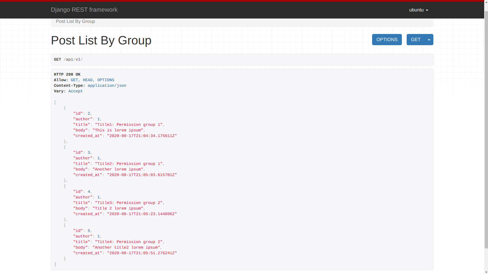
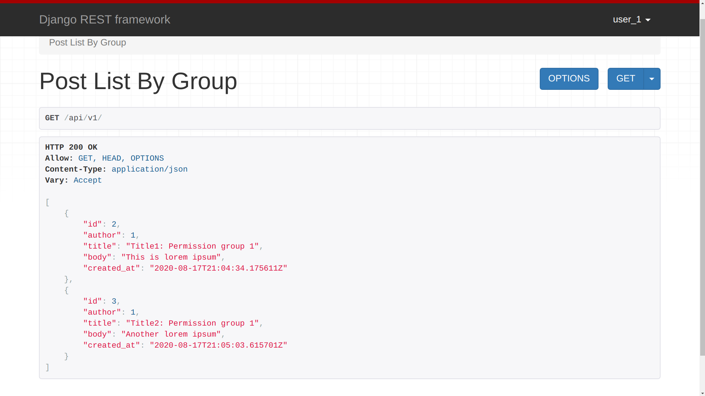
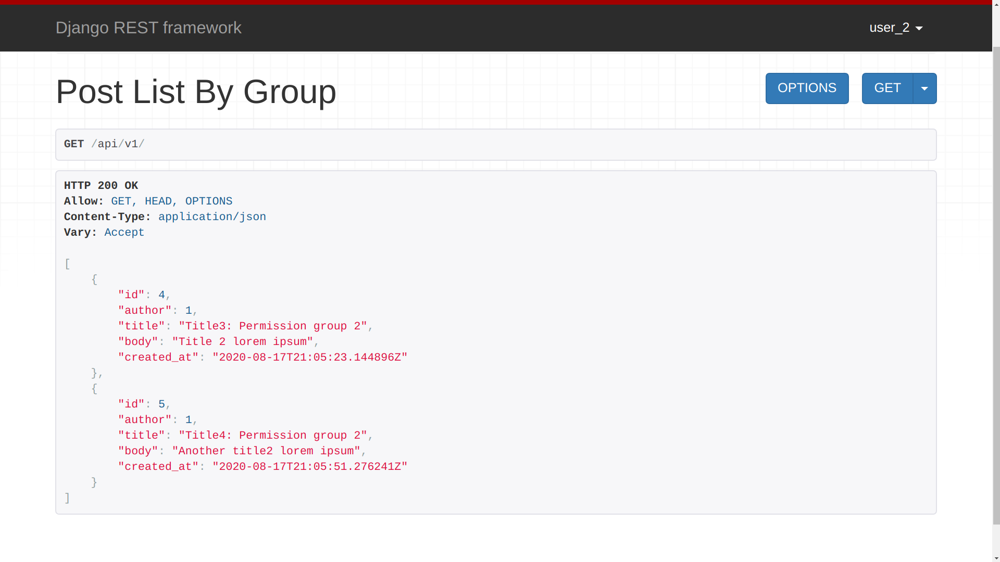

# Permission Based Filtered List View (Django + DRF Demo)

## Description

This self-contained DRF project aims to demonstrate group permission based View Filtering.

## Start the Container

* Clone the repository
    ```
    git clone git@github.com:rednafi/django-permission-listview.git
    ```

* Go to project root (where `migrate.py` lives).

    ```
    cd project_listview
    ```
* Spin up the container, run:

    ```
    chmod + x scripts/run.sh
    ./scripts/run.sh
    ```

## Explore the Admin Panel

* Go to the admin panel link: [http://localhost:8000/admin](http://localhost:8000/admin)

* Use the following credentials to log in as a superuser (I've already created one)

    ```
    username: ubuntu
    password: debian
    ```

## Check the Views

### Check Superuser View

* Go to the following link [http://localhost:8000/api/v1/](http://localhost:8000/api/v1/). You should see an `Unauthorized` error message.

* Log in as a superuser. Use these credentials:
    ```
    username: ubuntu
    password: debian
    ```
* Your View should look like this:
    


### Check Group 1 View

* Log out using the UI and log back in using these credentials.

    ```
    username: user_1
    password: helloworld12
    ```
* The expected view should be something like this:

    


### Check Group 2 View

* Log out using the UI and log back in using these credentials.

    ```
    username: user_2
    password: helloworld12
    ```
* The expected view should be something like this:

    
